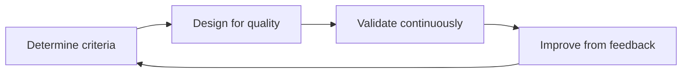

# FitTrack — Software Quality Assurance (SQA)

This document describes how FitTrack applies **systematic quality assurance**: measurable criteria (ISO/IEC 25010), architecture choices that support those criteria, and **continuous validation** through automated tests and CI/CD.

FitTrack is a fitness platform: users register via IAM, authenticate with JWT, and manage encrypted workouts through an API gateway (Traefik). Services communicate asynchronously via RabbitMQ (`user.registered`, `user.deleted`).

---

## 1. Quality in context

### Stakeholders and goals

| Stakeholder | Goal | Quality focus |
|-------------|------|----------------|
| End user | Log workouts safely and reliably | Security, usability, reliability |
| Developer (you) | Evolve services without breaking contracts | Maintainability, testability |
| School / assessor | Evidence of structured QA | Traceable criteria, automation, test pyramid |
| Operations (local/staging) | Detect regressions early | Monitoring, CI, health checks |

### Risks

- **Data breach** — workout titles/notes and credentials exposed.
- **Broken access control** — one user reads another’s workouts.
- **Event inconsistency** — account deleted in IAM but workouts remain.
- **Operational drift** — gateway misconfiguration blocks all workout traffic.

### Conscious trade-offs

You cannot maximize every ISO/IEC 25010 characteristic at once. FitTrack prioritizes:

| Priority | Chosen emphasis | Trade-off accepted |
|----------|-----------------|-------------------|
| High | **Security**, **reliability** | Stricter auth, rate limits, encryption → slightly slower onboarding under load tests |
| High | **Maintainability** | Manual mappers, explicit tests → more code than code-generation-only stacks |
| Medium | **Performance efficiency** | k6 thresholds are realistic for a student stack, not Netflix-scale SLOs |
| Lower (dev) | **Portability / compatibility** | Docker Compose on one machine; no multi-cloud HA yet |
| Deferred | Full **BDD/Cucumber** UI suite | Main journey validated by gateway script + k6 (see §5) |

Production would tighten trade-offs (TLS, httpOnly cookies, stricter latency SLOs). See [`SECURITY.md`](SECURITY.md).

---

## 2. Quality attributes and measurable criteria

Criteria are **specific, measurable, and testable** (not “the system must be fast”).

Reference model: [ISO/IEC 25010](https://iso25000.com/index.php/en/iso-25000-standards/iso-25010).

| ISO 25010 characteristic | FitTrack criterion | How we verify |
|--------------------------|-------------------|---------------|
| **Security** | All `/workouts/*` routes require a valid Bearer JWT; client `X-User-Id` is rejected with HTTP 400 | `WorkoutControllerIntegrationTest`, `scripts/test-gateway.sh` |
| **Security** | Passwords: min length, letter + digit; BCrypt strength 12; generic login errors | `AuthServiceTest`, `PasswordPolicy` |
| **Security** | Workout fields encrypted at rest (AES-256-GCM); key ≥ 32 characters in config | `WorkoutEncryptionServiceTest`, compose env validation |
| **Security** | CI runs `npm audit --audit-level=high` on every build (target: zero high/critical; see §9 for current debt) | GitHub Actions `ci.yml` |
| **Reliability** | IAM and Workout report `UP` on `/actuator/health` when dependencies are ready | Docker healthchecks, Prometheus `up` metric |
| **Reliability** | Account delete removes IAM user and eventually all workouts (`user.deleted`) | `UserDeletedConsumerTest`, gateway delete flow |
| **Performance efficiency** | Under k6 smoke (3 VUs, 30s): HTTP failure rate &lt; 10%, p95 latency &lt; 5s | `load-testing/k6/smoke.js` thresholds, `make load-test-smoke` |
| **Performance efficiency** | Under full k6 (default 10 VUs): same thresholds; observe Grafana HTTP 5xx ≈ 0 | `load-testing/k6/full-flow.js`, Grafana dashboard |
| **Maintainability** | Business rules covered by fast unit tests; API contracts documented | Gradle/Vitest suites, `contracts/asyncapi/` |
| **Compatibility** | AsyncAPI contract for `user.registered` / `user.deleted` matches implementation | Spec + `UserDeletedConsumerTest` / IAM publishers |
| **Usability** | Register → login → create workout reachable via UI on `localhost:3000` | Manual exploratory testing; optional future Playwright |

### Example measurable statements (as required by coursework)

- **Performance:** “During `make load-test-smoke`, fewer than 10% of HTTP requests fail and 95% complete within 5 seconds” (k6 `thresholds` in `load-testing/k6/*.js`).
- **Security:** “Every workout HTTP call without `Authorization: Bearer` returns 401 via ForwardAuth.”
- **Security:** “Dependency scan in CI fails on npm vulnerabilities rated high or critical.”

Tighten numbers for your report if you collect baseline metrics from Grafana (`histogram_quantile` on `http_server_requests_seconds`).

---

## 3. Linking criteria to architecture

| Criterion | Architectural choice |
|-----------|------------------------|
| Secure perimeter | Single entry: **Traefik**; browser never calls service ports directly |
| Authentication | **IAM** issues JWT; **ForwardAuth** on `/workouts` |
| Authorization | Workout service trusts only `X-Internal-User-Id` from gateway + shared secret |
| Confidentiality | **AES-256-GCM** in workout-service; BCrypt + JWT in IAM |
| Reliability / decoupling | **RabbitMQ** events for cross-service purge; no synchronous IAM→Workout HTTP |
| Observability | **Prometheus** scrape + **Grafana** dashboard (`monitoring/`) |
| Abuse resistance | Traefik **rate-limit** on auth endpoints |
| Stateless scaling path | JWT + stateless API instances behind gateway (horizontal scale ready in design) |

---

## 4. QA lifecycle (continuous cycle)



| Phase | FitTrack activity |
|-------|-------------------|
| **Determine criteria** | This document + [`SECURITY.md`](SECURITY.md) |
| **Design for quality** | Gateway auth, encryption, events, validation on DTOs |
| **Validate** | `make test`, CI, `make test-gateway`, k6, Grafana |
| **Improve** | Fix failures from CI/k6/Grafana; refactor with tests green |

QA happens in **requirements** (criteria table), **architecture** (§3), **coding** (TDD-friendly unit tests), **testing** (pyramid below), **CI/CD** (workflows), and **production-like monitoring** (Prometheus/Grafana).

---

## 5. Test pyramid and evidence

Distribution follows the [Practical Test Pyramid](https://martinfowler.com/articles/practical-test-pyramid.html): **many fast unit tests**, **some integration/service tests**, **few slow E2E/load tests**.

```
        ┌─────────────┐
        │  E2E / k6   │  few — main API journey via Traefik
        ├─────────────┤
        │ Integration │  some — Testcontainers (Mongo, RabbitMQ)
        ├─────────────┤
        │    Unit     │  many — domain, crypto, mappers, UI atoms
        └─────────────┘
```

### Unit tests (fast, isolated)

| Area | Examples | Command |
|------|----------|---------|
| IAM | `AuthServiceTest`, `ForwardAuthNetworkFilterTest` | `./gradlew test` in `iam-service` |
| Workout | `WorkoutServiceTest`, `WorkoutEncryptionServiceTest`, `WorkoutMapperTest` | `./gradlew test` in `workout-service` |
| Frontend | `Button.test.tsx`, `api.test.ts`, … | `npm test -- --run` |

### Service / integration tests

| Area | Examples | Notes |
|------|----------|-------|
| IAM API + Mongo | `AuthControllerIntegrationTest` | Testcontainers |
| Workout API + Mongo | `WorkoutControllerIntegrationTest` | JWT + persistence |
| Messaging | `UserDeletedConsumerTest` | RabbitMQ contract behavior |

Run all: `make test`.

### Contract tests (microservice agreements)

- **AsyncAPI:** [`contracts/asyncapi/user-events.asyncapi.yaml`](../contracts/asyncapi/user-events.asyncapi.yaml) defines `user.registered` and `user.deleted` payloads.
- **Verification:** consumer tests + IAM publishers; no duplicate HTTP contract because services do not call each other synchronously.

### UI / end-to-end tests (sparingly)

| Type | Tool | Scope |
|------|------|-------|
| API E2E | `scripts/test-gateway.sh` | Register → workout CRUD → reject `X-User-Id` → account delete |
| Load E2E | k6 `full-flow.js` / `smoke.js` | Sustained traffic through Traefik |
| UI E2E | — | Not automated yet; manual exploratory on Next.js UI |

`make test-gateway` after `make up`.

### Acceptance / BDD-style scenarios

Business scenarios are written in Gherkin for readability (Cucumber-ready). Today they are executed by the gateway script, not by Cucumber JVM:

- [`docs/acceptance-scenarios.feature`](acceptance-scenarios.feature)

Mapping: each scenario ↔ steps in `scripts/test-gateway.sh`.

### Exploratory testing

Manual sessions: new exercise editor flows, token expiry refresh, Grafana during `make load-test`, Traefik misconfiguration recovery (see root `README.md` troubleshooting).

---

## 6. Additional automated quality checks

| Check | FitTrack implementation | When |
|-------|-------------------------|------|
| **Static analysis** | `npm run lint` (Next.js ESLint) | Every CI run |
| **Unit/integration tests** | Gradle + Vitest | Every CI run |
| **Security — dependencies** | `npm audit --audit-level=high` | CI |
| **Security — application** | OWASP-oriented controls in [`SECURITY.md`](SECURITY.md); SAST/DAST tools optional for report | Manual / future SonarQube |
| **Performance** | k6 thresholds + Grafana | Local `make load-test*`; optional `validation.yml` workflow |
| **Code review** | Git PR review (recommended) | Human |

---

## 7. CI/CD integration

### Fast CI (every push/PR)

Workflow: [`.github/workflows/ci.yml`](../.github/workflows/ci.yml)

1. Build & **unit/integration tests** (IAM, Workout) with Docker for Testcontainers  
2. Frontend **lint** + **unit tests**  
3. **npm audit** (high/critical)  
4. **AsyncAPI** file present (contract not drifted away)

### Validation pipeline (staging-like, manual or main branch)

Workflow: [`.github/workflows/validation.yml`](../.github/workflows/validation.yml)

1. `docker compose up` — build stack  
2. `scripts/test-gateway.sh` — acceptance journey  
3. Optional: k6 smoke  

Pipeline results and k6 JSON (`load-testing/results/`) are **evidence of quality** for your portfolio.

### Local equivalent

```bash
make test              # Fast CI equivalent
make test-gateway      # E2E acceptance
make load-test-smoke   # Performance smoke
make monitoring        # Observe during load
```

---

## 8. Engineering practices

| Practice | In FitTrack |
|----------|-------------|
| **TDD** | Domain and security tests written alongside features (e.g. encryption, delete purge) |
| **BDD** | Gherkin scenarios documented; executable via gateway script |
| **Continuous refactoring** | MapStruct → manual mapper when generated code failed; tests locked behavior |
| **Pair programming / review** | Recommended for PRs; not enforced in repo |

---

## 9. Gaps and planned improvements

Honest assessment for coursework reflection:

| Item | Status |
|------|--------|
| SonarQube / SpotBugs in CI | Not wired — add for deeper static analysis |
| Cucumber runner | Scenarios documented; JVM Cucumber optional |
| Playwright UI E2E | Not implemented |
| OWASP Dependency-Check (Gradle) | Use CI audit + manual `./gradlew dependencyUpdates` |
| npm audit (high/critical in devDependencies) | CI runs scan; upgrade Next/Vitest/eslint chain to clear advisories |
| Production DAST | Out of scope for local Compose |

---

## 10. References

| Topic | Link |
|-------|------|
| ISO/IEC 25010 | https://iso25000.com/index.php/en/iso-25000-standards/iso-25010 |
| Test pyramid | https://martinfowler.com/articles/practical-test-pyramid.html |
| Testing & architecture | https://martinfowler.com/testing |
| Microservices testing | https://microservices.io/patterns |
| OWASP testing | https://owasp.org/www-project-web-security-testing-guide/ |
| SonarQube | https://www.sonarqube.org |
| k6 (load) | https://k6.io |
| Cucumber | https://cucumber.io |
| OWASP FitTrack mapping | [`SECURITY.md`](SECURITY.md) |
| Monitoring | [`../monitoring/README.md`](../monitoring/README.md) |
| Load testing | [`../load-testing/README.md`](../load-testing/README.md) |

---

## Quick checklist for assessors

- [ ] Measurable criteria in §2  
- [ ] Architecture traceability in §3  
- [ ] Test pyramid with repo paths in §5  
- [ ] CI workflow green on GitHub  
- [ ] `make test-gateway` passes on running stack  
- [ ] k6 smoke thresholds pass  
- [ ] Grafana shows services UP during demo  
