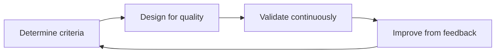

# FiTrack — Software Quality Assurance (SQA)

This document describes how FiTrack applies **systematic quality assurance**: measurable criteria (ISO/IEC 25010), architecture choices that support those criteria, and **continuous validation** through automated tests and CI/CD.

FiTrack is a fitness platform: users register via IAM, authenticate with JWT, and manage encrypted workouts through an API gateway (Traefik). Services communicate asynchronously via RabbitMQ (`user.registered`, `user.deleted`).

---

## 1. Quality in context

### Stakeholders and goals

| Stakeholder | Goal | Quality focus |
|-------------|------|----------------|
| End user | Log workouts safely and reliably | Security, usability, reliability |
| Developer (you) | Evolve services without breaking contracts | Maintainability, testability |
| School / assessor | Evidence of structured QA | Traceable criteria, automation, test pyramid |
| Operations (local/staging) | Detect regressions early | Monitoring, CI, health checks |

### Risks

- **Data breach** — workout titles/notes and credentials exposed.
- **Broken access control** — one user reads another’s workouts.
- **Event inconsistency** — account deleted in IAM but workouts remain.
- **Operational drift** — gateway misconfiguration blocks all workout traffic.

### Conscious trade-offs

You cannot maximize every ISO/IEC 25010 characteristic at once. FiTrack prioritizes:

| Priority | Chosen emphasis | Trade-off accepted |
|----------|-----------------|-------------------|
| High | **Security**, **reliability** | Stricter auth, rate limits, encryption → slightly slower onboarding under load tests |
| High | **Maintainability** | Manual mappers, explicit tests → more code than code-generation-only stacks |
| Medium | **Performance efficiency** | k6 thresholds are realistic for a student stack, not Netflix-scale SLOs |
| Lower (dev) | **Portability / compatibility** | Docker Compose on one machine; no multi-cloud HA yet |
| Medium | **BDD API acceptance** (Cucumber) | API scenarios automated; UI still manual exploratory |

Production would tighten trade-offs (TLS, httpOnly cookies, stricter latency SLOs). See [`SECURITY.md`](SECURITY.md).

---

## 2. Quality attributes and measurable criteria

Criteria are **specific, measurable, and testable** (not “the system must be fast”).

Reference model: [ISO/IEC 25010](https://iso25000.com/index.php/en/iso-25000-standards/iso-25010).

| ISO 25010 characteristic | FiTrack criterion | How we verify |
|--------------------------|-------------------|---------------|
| **Security** | All `/workouts/*` routes require a valid Bearer JWT; client `X-User-Id` is rejected with HTTP 400 | `WorkoutControllerIntegrationTest`, `scripts/test-gateway.sh` |
| **Security** | Passwords: min length, letter + digit; BCrypt strength 12; generic login errors | `AuthServiceTest`, `PasswordPolicy` |
| **Security** | Workout fields encrypted at rest (AES-256-GCM); key ≥ 32 characters in config | `WorkoutEncryptionServiceTest`, compose env validation |
| **Security** | CI runs `npm audit --omit=dev --audit-level=high` (production deps; Next.js 16) | GitHub Actions `ci.yml` |
| **Reliability** | IAM and Workout report `UP` on `/actuator/health` when dependencies are ready | Docker healthchecks, Prometheus `up` metric |
| **Reliability** | Account delete removes IAM user and eventually all workouts (`user.deleted`) | `UserDeletedConsumerTest`, gateway delete flow |
| **Performance efficiency (NFR-01)** | 10 VUs, 1 min sustained: p95 &lt; 5 s and failure rate &lt; 10% on all five workout endpoints | `load-testing/k6/nfr-01-load.js`, `make load-test-nfr-01` |
| **Performance efficiency (NFR-05)** | Same load profile: HTTP 5xx rate 0% | `fitrack_http_5xx` threshold in `k6/lib/nfr-thresholds.js` |
| **Performance efficiency (NFR-03)** | Ramp 0→50 VUs over 8 min: application error rate 0% (HTTP 5xx) | `load-testing/k6/nfr-03-stress.js`, `make load-test-nfr-03` |
| **Performance efficiency (smoke)** | Quick pre-check before NFR runs (3 VUs, 30s) | `load-testing/k6/smoke.js`, `make load-test-smoke` |
| **Maintainability** | Business rules covered by fast unit tests; API contracts documented | Gradle/Vitest suites, `contracts/asyncapi/` |
| **Compatibility** | AsyncAPI contract for `user.registered` / `user.deleted` matches implementation | Spec + `UserDeletedConsumerTest` / IAM publishers |
| **Usability** | Register → login → create workout reachable via UI on `localhost:3000` | Manual exploratory testing; optional future Playwright |

### Example measurable statements (as required by coursework)

- **Performance (NFR-01):** “During `make load-test-nfr-01`, fewer than 10% of HTTP requests fail and 95% complete within 5 seconds on each of the five workout-management endpoints.”
- **Performance (NFR-05):** “During the same run, HTTP 5xx rate is 0%.”
- **Performance (NFR-03):** “During `make load-test-nfr-03`, ramping 0→50 VUs over 8 minutes produces zero application errors (HTTP 5xx).”
- **Security:** “Every workout HTTP call without `Authorization: Bearer` returns 401 via ForwardAuth.”
- **Security:** “Dependency scan in CI fails on npm vulnerabilities rated high or critical.”

Tighten numbers for your report if you collect baseline metrics from Grafana (`histogram_quantile` on `http_server_requests_seconds`).

---

## 3. Linking criteria to architecture

| Criterion | Architectural choice |
|-----------|------------------------|
| Secure perimeter | Single entry: **Traefik**; browser never calls service ports directly |
| Authentication | **IAM** issues JWT; **ForwardAuth** on `/workouts` |
| Authorization | Workout service trusts only `X-Internal-User-Id` from gateway + shared secret |
| Confidentiality | **AES-256-GCM** in workout-service; BCrypt + JWT in IAM |
| Reliability / decoupling | **RabbitMQ** events for cross-service purge; no synchronous IAM→Workout HTTP |
| Observability | **Prometheus** scrape + **Grafana** dashboard (`monitoring/`) |
| Abuse resistance | Traefik **rate-limit** on auth endpoints |
| Stateless scaling path | JWT + stateless API instances behind gateway (horizontal scale ready in design) |

---

## 4. QA lifecycle (continuous cycle)



| Phase | FiTrack activity |
|-------|-------------------|
| **Determine criteria** | This document + [`SECURITY.md`](SECURITY.md) |
| **Design for quality** | Gateway auth, encryption, events, validation on DTOs |
| **Validate** | `make test`, CI, `make test-acceptance`, k6, SonarQube, Grafana |
| **Improve** | Fix failures from CI/k6/Grafana; refactor with tests green |

QA happens in **requirements** (criteria table), **architecture** (§3), **coding** (TDD-friendly unit tests), **testing** (pyramid below), **CI/CD** (workflows), and **production-like monitoring** (Prometheus/Grafana).

---

## 5. Test pyramid and evidence

Distribution follows the [Practical Test Pyramid](https://martinfowler.com/articles/practical-test-pyramid.html): **many fast unit tests**, **some integration/service tests**, **few slow E2E/load tests**.

```
        ┌─────────────┐
        │  E2E / k6   │  few — main API journey via Traefik
        ├─────────────┤
        │ Integration │  some — Testcontainers (Mongo, RabbitMQ)
        ├─────────────┤
        │    Unit     │  many — domain, crypto, mappers, UI atoms
        └─────────────┘
```

### Unit tests (fast, isolated)

| Area | Examples | Command |
|------|----------|---------|
| IAM | `AuthServiceTest`, `ForwardAuthNetworkFilterTest` | `./gradlew test` in `iam-service` |
| Workout | `WorkoutServiceTest`, `WorkoutEncryptionServiceTest`, `WorkoutMapperTest` | `./gradlew test` in `workout-service` |
| Frontend | `Button.test.tsx`, `api.test.ts`, … | `npm test -- --run` |

### Service / integration tests

| Area | Examples | Notes |
|------|----------|-------|
| IAM API + Mongo | `AuthControllerIntegrationTest` | Testcontainers |
| Workout API + Mongo | `WorkoutControllerIntegrationTest` | JWT + persistence |
| Messaging | `UserDeletedConsumerTest` | RabbitMQ contract behavior |

Run all: `make test`.

### Contract tests (microservice agreements)

- **AsyncAPI:** [`contracts/asyncapi/user-events.asyncapi.yaml`](../contracts/asyncapi/user-events.asyncapi.yaml) defines `user.registered` and `user.deleted` payloads.
- **Verification:** consumer tests + IAM publishers; no duplicate HTTP contract because services do not call each other synchronously.

### UI / end-to-end tests (sparingly)

| Type | Tool | Scope |
|------|------|-------|
| API E2E (bash) | `scripts/test-gateway.sh` | Extended journey incl. re-register after delete |
| **Acceptance (BDD)** | **Cucumber** (`acceptance-tests/`) | [`docs/acceptance-scenarios.feature`](acceptance-scenarios.feature) |
| Load E2E | k6 `full-flow.js` / `smoke.js` | Sustained traffic through Traefik |
| UI E2E | — | Manual exploratory on Next.js 16 UI |

```bash
make test-acceptance   # Cucumber (preferred for coursework BDD evidence)
make test-gateway      # bash equivalent with extra checks
```

After `make up`.

### Acceptance / BDD (Cucumber)

| Artifact | Path |
|----------|------|
| Gherkin features | [`docs/acceptance-scenarios.feature`](acceptance-scenarios.feature) |
| Step definitions | [`acceptance-tests/step-definitions/api.steps.js`](../acceptance-tests/step-definitions/api.steps.js) |
| JSON report | `acceptance-tests/reports/cucumber-report.json` |

### Exploratory testing

Manual sessions: new exercise editor flows, token expiry refresh, Grafana during `make load-test`, Traefik misconfiguration recovery (see root `README.md` troubleshooting).

---

## 6. Additional automated quality checks

| Check | FiTrack implementation | When |
|-------|-------------------------|------|
| **Static analysis** | `npm run lint` (ESLint 9 + `eslint-config-next`) | Every CI run |
| **Static analysis (deep)** | **SonarQube / SonarCloud** + JaCoCo | [`.github/workflows/sonar.yml`](../.github/workflows/sonar.yml) — see [`SONAR.md`](SONAR.md) |
| **Unit/integration tests** | Gradle + Vitest | Every CI run |
| **Security — dependencies** | `npm audit --omit=dev --audit-level=high` | CI |
| **Security — container images** | **Trivy** on IAM & Workout Docker images (CRITICAL/HIGH) | [`security-scan.yml`](../.github/workflows/security-scan.yml) on `main` |
| **Security — DAST** | **OWASP ZAP baseline** against Traefik (`/auth`, `/workouts`) | [`security-scan.yml`](../.github/workflows/security-scan.yml) |
| **Security — application** | OWASP controls in [`SECURITY.md`](SECURITY.md) | Design + tests |
| **Performance** | k6 thresholds + Grafana | Local `make load-test*`; optional `validation.yml` workflow |
| **Code review** | Git PR review (recommended) | Human |

---

## 7. CI/CD integration

### Fast CI (every push/PR)

Workflow: [`.github/workflows/ci.yml`](../.github/workflows/ci.yml)

1. Build & **unit/integration tests** (IAM, Workout) with Docker for Testcontainers  
2. Frontend **lint** + **unit tests**  
3. **npm audit** (production deps, high+)  
4. **AsyncAPI** file present (contract not drifted away)

### SonarQube (push/PR when configured)

Workflow: [`.github/workflows/sonar.yml`](../.github/workflows/sonar.yml) — requires `SONAR_TOKEN` and `SONAR_ORGANIZATION` secrets ([`SONAR.md`](SONAR.md)).

### Validation pipeline (staging-like, manual or main branch)

Workflow: [`.github/workflows/validation.yml`](../.github/workflows/validation.yml)

1. `docker compose up` — build stack  
2. **Cucumber** — `docs/acceptance-scenarios.feature` via `make test-acceptance`  
3. Optional: k6 smoke (manual workflow dispatch)  

### Security scan pipeline (main branch)

Workflow: [`.github/workflows/security-scan.yml`](../.github/workflows/security-scan.yml)

1. **Trivy** — build IAM/Workout images; fail on fixable CRITICAL/HIGH CVEs; upload SARIF  
2. **OWASP ZAP baseline** — DAST against running stack via Traefik; upload HTML/JSON report  

Local: `make security-scan-images`, `make security-scan-dast` (stack up). See [`SECURITY.md`](SECURITY.md).

### CD — publish deployable images (main + tags)

Workflow: [`.github/workflows/cd.yml`](../.github/workflows/cd.yml)

1. Build **IAM**, **Workout**, and **Frontend** (Next.js standalone) images with Buildx  
2. Multi-arch **linux/amd64 + linux/arm64** (x86 servers and Raspberry Pi)  
3. Push to **GHCR** `ghcr.io/<owner>/fitrack-{iam,workout,frontend}` using `GITHUB_TOKEN` (no extra secrets)  
4. Tags: branch, `latest` on default branch, short SHA, and semver on `v*` tags

Pull on any host: `docker pull ghcr.io/<owner>/fitrack-iam:latest`. Cut a release with `git tag v1.0.0 && git push --tags`.

Pipeline results and k6 JSON (`load-testing/results/`) are **evidence of quality** for your portfolio.

### Local equivalent

```bash
make test              # Fast CI equivalent
make test-acceptance   # Cucumber BDD acceptance
make test-gateway      # bash E2E (extra checks)
make load-test-smoke   # Performance smoke
make monitoring        # Observe during load
```

---

## 8. Engineering practices

| Practice | In FiTrack |
|----------|-------------|
| **TDD** | Domain and security tests written alongside features (e.g. encryption, delete purge) |
| **BDD** | Gherkin in `docs/acceptance-scenarios.feature`; executed by Cucumber (`make test-acceptance`) |
| **Continuous refactoring** | MapStruct → manual mapper when generated code failed; tests locked behavior |
| **Pair programming / review** | Recommended for PRs; not enforced in repo |

---

## 9. Gaps and planned improvements

Honest assessment for coursework reflection:

| Item | Status |
|------|--------|
| SonarQube quality gate strict pass | Wire secrets; tune quality gate in SonarCloud |
| Playwright UI E2E | Not implemented |
| OWASP Dependency-Check (Gradle) | Use CI npm audit + manual `./gradlew dependencyUpdates` |
| Vitest 4 upgrade | Blocked on Rolldown/JSX in tests; dev-only CVE (Vitest UI server) documented |
| Next bundled PostCSS (moderate) | Transitive; monitor Next releases |
| Production DAST | Out of scope for local Compose |

---

## 10. References

| Topic | Link |
|-------|------|
| ISO/IEC 25010 | https://iso25000.com/index.php/en/iso-25000-standards/iso-25010 |
| Test pyramid | https://martinfowler.com/articles/practical-test-pyramid.html |
| Testing & architecture | https://martinfowler.com/testing |
| Microservices testing | https://microservices.io/patterns |
| OWASP testing | https://owasp.org/www-project-web-security-testing-guide/ |
| SonarQube | https://www.sonarqube.org |
| k6 (load) | https://k6.io |
| Cucumber | https://cucumber.io |
| SonarCloud setup | [`SONAR.md`](SONAR.md) |
| OWASP FiTrack mapping | [`SECURITY.md`](SECURITY.md) |
| Monitoring | [`../monitoring/README.md`](../monitoring/README.md) |
| Load testing | [`../load-testing/README.md`](../load-testing/README.md) |

---

## Quick checklist for assessors

- [ ] Measurable criteria in §2  
- [ ] Architecture traceability in §3  
- [ ] Test pyramid with repo paths in §5  
- [ ] CI workflow green on GitHub  
- [ ] `make test-acceptance` (Cucumber) passes on running stack  
- [ ] SonarQube dashboard shows analysis (if secrets configured)  
- [ ] k6 smoke thresholds pass  
- [ ] Grafana shows services UP during demo  
